# Playwright Automation Framework | End-to-End Testing

# Key Highlights

Automated UI test cases using Playwright for Chromium, Firefox, and WebKit

Implemented robust locator strategies using role, text, and CSS selectors

Designed reusable test scripts following best automation practices

Performed functional, regression, and smoke testing

Handled assertions, waits, and browser contexts for stable test execution

Generated HTML test reports for easy analysis

Integrated API testing to validate backend responses (where applicable)

# Test Coverage

Login & authentication flows

Form validation & UI behavior

Navigation & cross-browser compatibility

End-to-End user scenarios

# Tech Stack

Automation Tool: Playwright

Language: TypeScript

Test Runner: Playwright Test

Assertions & Reporting: Built-in Playwright reporters

Version Control: Git & GitHub

# Practice Webistes

1. http://www.automationpractice.pl/index.php
2. https://demo.nopcommerce.com
3. https://demowebshop.tricentis.com/
4. https://testautomationpractice.blogspot.com/

# TEST Result outputs

1. Flipkart URL :- 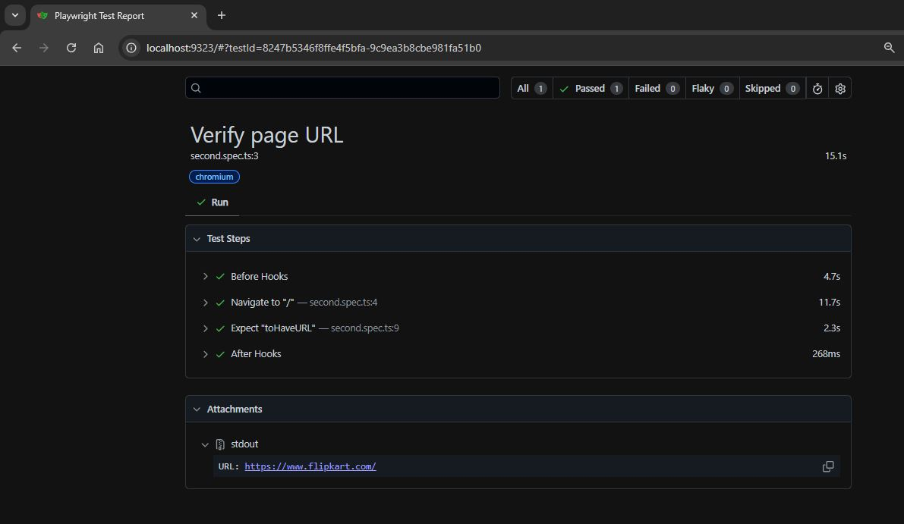
2. Flipkart Title :- 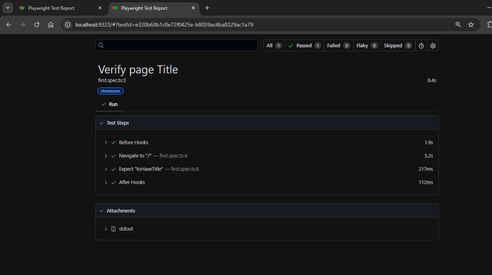
3. Youtube (URL and Title) :-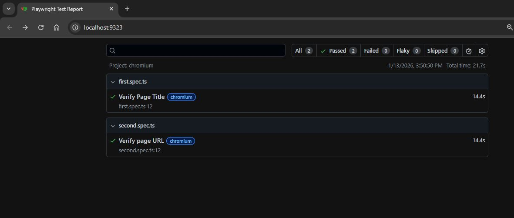
4. Nopcommerce :-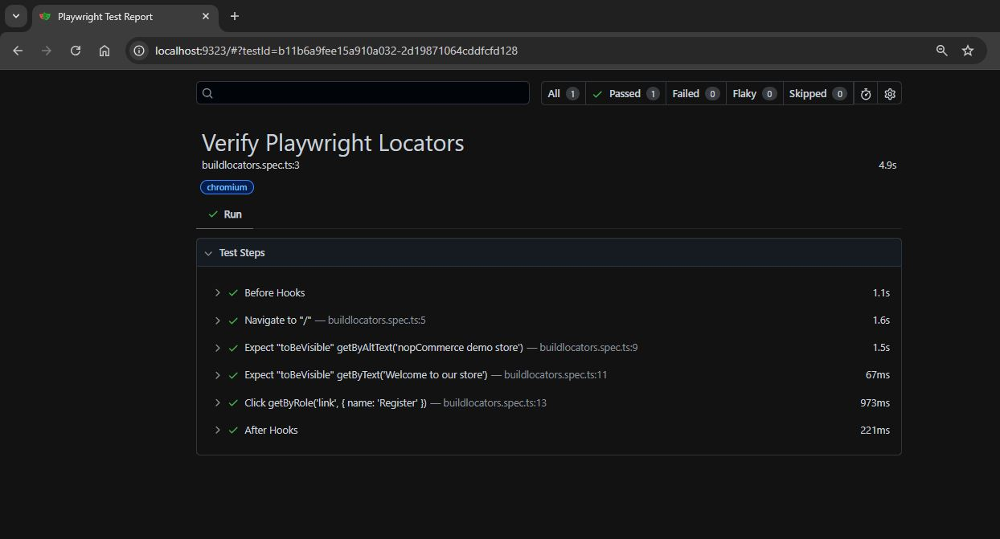
5. Nopcommerce - Registration Form :-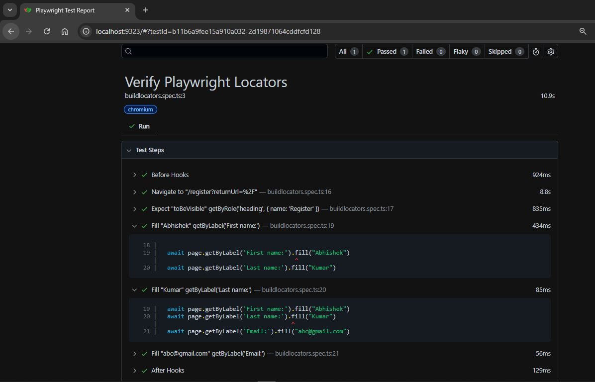
6. Nopcommerce - Search Bar :-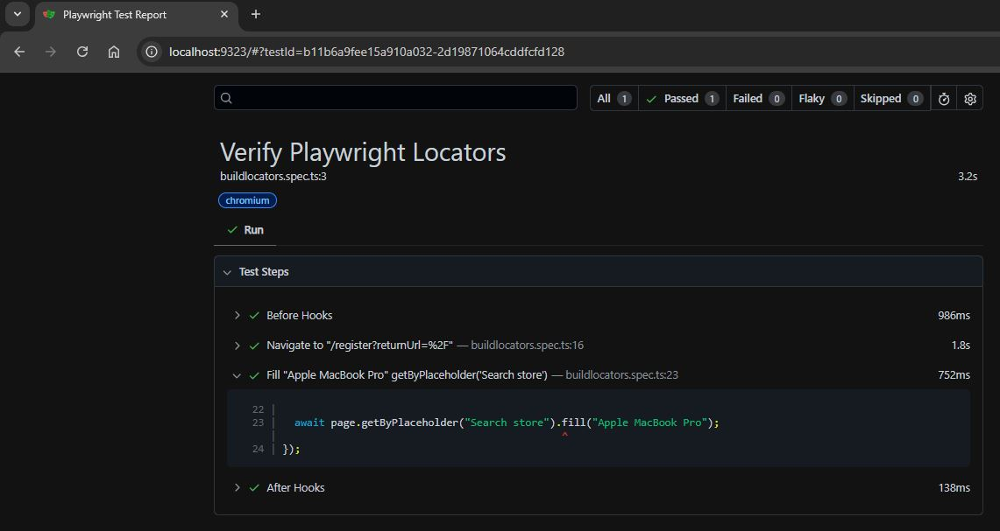
7. Your Shop :-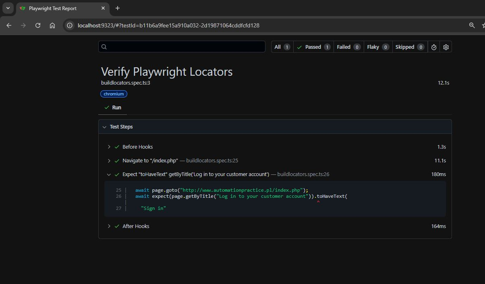
8. Demo Web Shop :-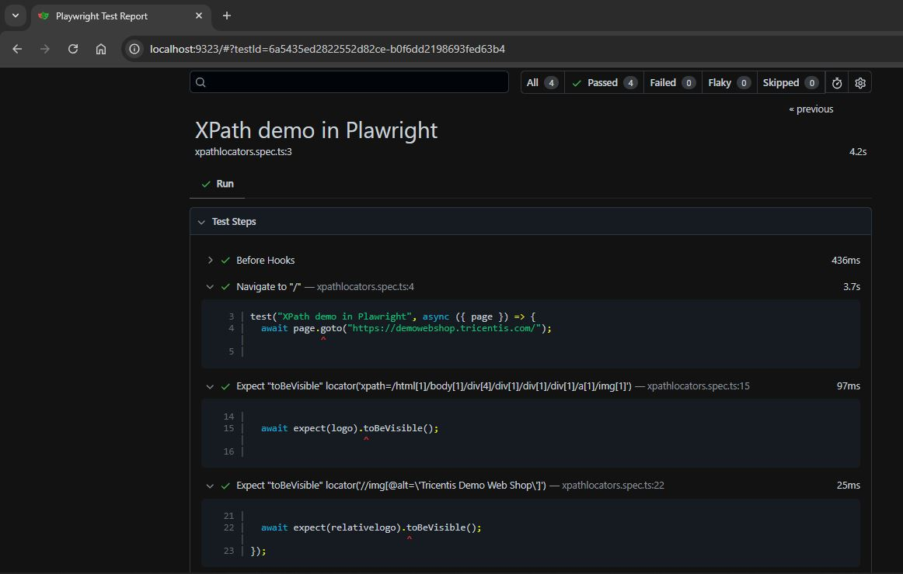
9. Demo Web Shop :-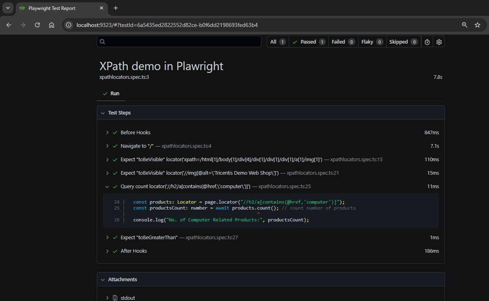
10. Demo Web Shop :-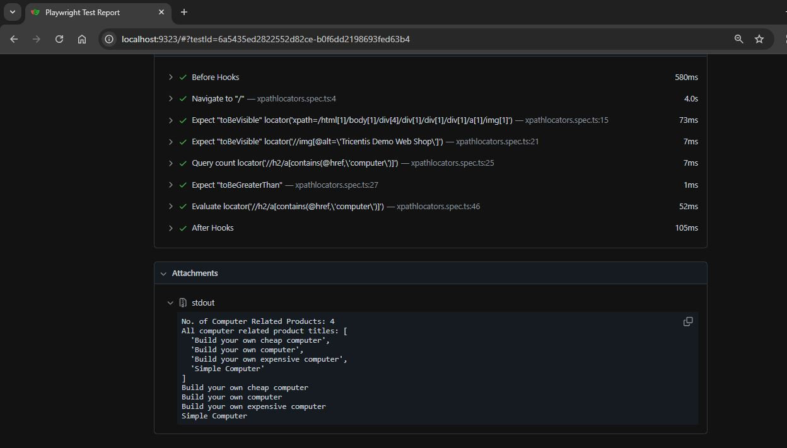
11. Demo Web Shop :-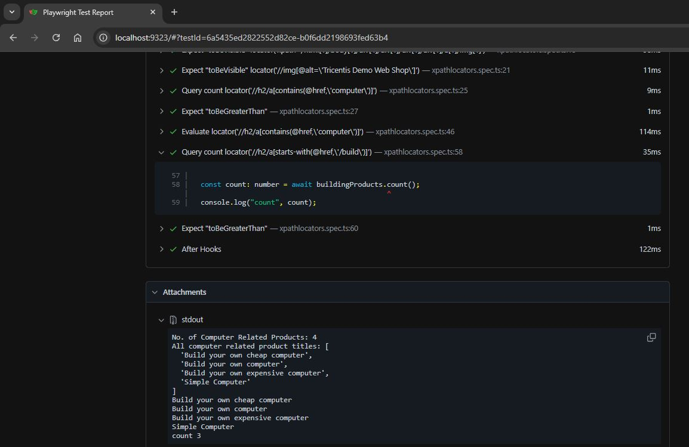
12. Demo Web Shop :-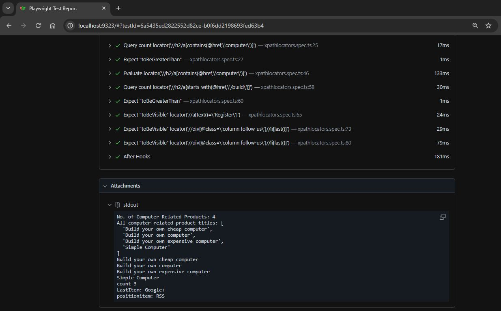
13. Automation testing Practice :-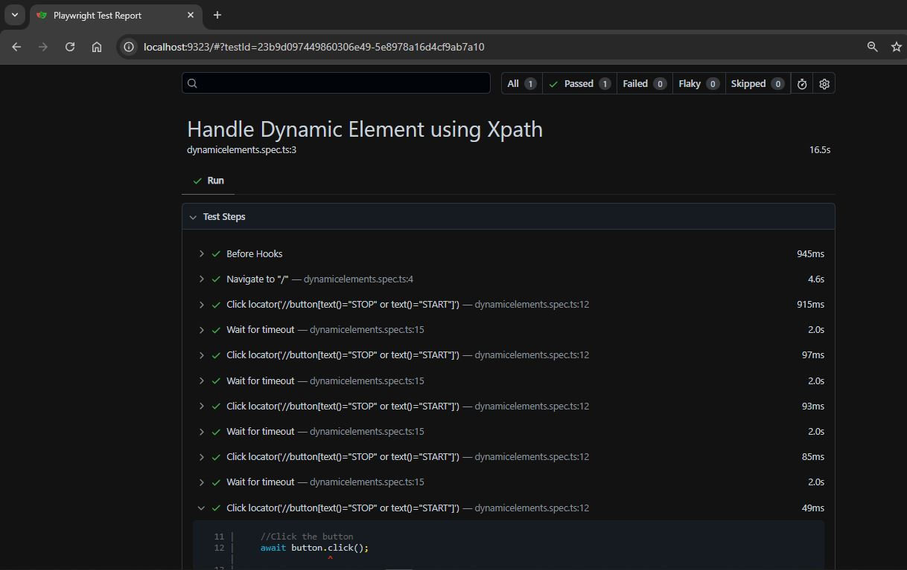

# Short notes

import { test, expect } from '@playwright/test';

test('has title', async ({ page }) => {
await page.goto('http://www.automationpractice.pl/index.php');

// Expect a title "to contain" a substring.
await expect(page).toHaveTitle(/Playwright/);
});

test('get started link', async ({ page }) => {
await page.goto('http://www.automationpractice.pl/index.php');

// Click the get started link.
await page.getByRole('link', { name: 'Get started' }).click();

// Expects page to have a heading with the name of Installation.
await expect(page.getByRole('heading', { name: 'Installation' })).toBeVisible();
});

# Explaination each line by line

# import { test, expect } from '@playwright/test';

test → used to define a test case

expect → used to validate / assert results

@playwright/test → Playwright’s built-in test runner

# test('has title', async ({ page }) => { });

Explanation:

test('has title', ...)
→ Test name is "has title"

async ({ page })
→ Playwright automatically provides a browser page
→ page represents one browser tab

# Step 1: Open website

# await page.goto('http://www.automationpractice.pl/index.php');

Opens the Playwright official website

await waits until the page loads completely

# Step 2: Validate page title

# await expect(page).toHaveTitle(/Playwright/);

What this does:

Gets the page title

Checks whether the title contains the word "Playwright"

/Playwright/ is a regular expression

✅ Test passes if title contains “Playwright”
❌ Test fails if not

# Second Test Case – Click Get Started Link

# test('get started link', async ({ page }) => { })

This is a separate test case

Tests a navigation flow

# Step 1: Open website

# await page.goto('http://www.automationpractice.pl/index.php');

Same as before – opens the homepage.

# Step 2: Click “Get started” link

# await page.getByRole('link', { name: 'Get started' }).click();

Explanation:

getByRole('link') → finds an element with HTML role = link

{ name: 'Get started' } → link text

.click() → clicks the link

👉 This is best practice because it’s:

Stable

Accessibility-friendly

Less flaky than XPath/CSS

# Step 3: Verify navigation success

# await expect(page.getByRole('heading', { name: 'Installation' })).toBeVisible();

🔹 What this checks:

Finds a heading with text "Installation"

Confirms it is visible on the page

✅ Means user successfully reached the Get Started / Installation page

# What is a Fixture in Playwright?

In Playwright, a fixture is a predefined setup and cleanup mechanism that provides required objects (like browser, page, context, test data) to your test before it runs and cleans them after the test finishes.

👉 Simply put:
Fixture = Ready-made test environment

🔹 Why do we need fixtures?

1. Fixtures help to:
2. Avoid duplicate setup code
3. Automatically manage browser & page lifecycle
4. Keep tests clean and readable
5. Share common setup across tests

# Example you already used (Built-in Fixture)

test('example test', async ({ page }) => {
await page.goto('https://example.com');
});

What’s happening?
-> page is a fixture
-> Playwright automatically:

--- Opens a browser
--- Creates a new page
--- Closes it after the test

You didn’t write any setup/cleanup code 👍

# Common Built-in Fixtures

| Fixture    | Purpose                  |
| ---------- | ------------------------ |
| `page`     | Single browser tab       |
| `browser`  | Browser instance         |
| `context`  | Isolated browser session |
| `request`  | API testing              |
| `testInfo` | Test metadata            |

# 🔹 Real-World Example

- In real projects, fixtures are used for:

-- Login once and reuse
-- Test data setup
-- API authentication tokens
-- Environment setup

# First test code find Ttile

import { test, expect } from "@playwright/test";

test("Verify Page title", async ({ page }) => {
await page.goto("http://www.automationpractice.pl/index.php");
const title: string = await page.title();
console.log("Title", title);
await expect(page).toHaveTitle("My Shop");
});

# Output

npx playwright test
Running 3 tests using 2 workers
[2/3] [chromium] › tests\first.spec.ts:3:5 ›
[firefox] › tests\first.spec.ts:3:5 › Verify Verify Page title Page title
Title My Shop
[chromium] › tests\first.spec.ts:3:5 › Verify Page title
Title My Shop
[webkit] › tests\first.spec.ts:3:5 › Verify Page title
Title My Shop
3 passed (57.0s)

To open last HTML report run:

npx playwright show-report

# Show HTML Reports

npx playwright show-report

Serving HTML report at http://localhost:9323. Press Ctrl+C to quit.

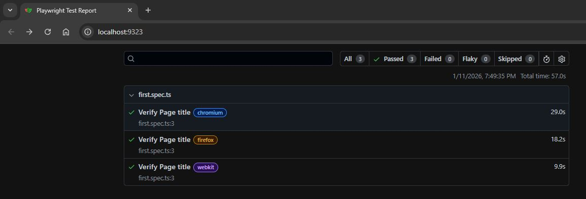
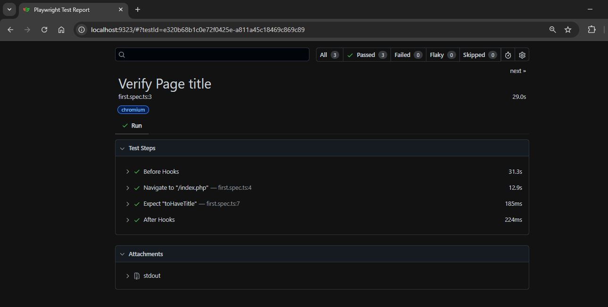

## Locators

Locator:- A Locator in Playwright is an object used to find and interact with elements on a web page (buttons, inputs, links, text, etc.).

👉 In simple words:
Locator = Address of a web element

# Offical link(https://playwright.dev/docs/locators) to read all locators with example.

These are the recommended built-in locators.

1. page.getByRole() to locate by explicit (means tag is name is diffrent and role is diffrent {ex:- heading, checkbox}) and implicit (means tag name and role both are same {ex:- button}) accessibility attributes.
2. page.getByText() to locate by text content.
3. page.getByLabel() to locate a form control by associated label's text.
4. page.getByPlaceholder() to locate an input by placeholder.
5. page.getByAltText() to locate an element, usually image, by its text alternative.
6. page.getByTitle() to locate an element by its title attribute.
7. page.getByTestId() to locate an element based on its data-testid attribute (other attributes can be configured).

# XPath

XPath (XML Path Language) is used to locate elements in a web page based on the DOM structure.

🔹 Types of XPath
1️⃣ Absolute XPath
//html/body/div[1]/div/form/input

Starts from root /html

- Very fragile
- Breaks if UI changes

2️⃣ Relative XPath ✅ (Preferred)
//input[@id='email']

Starts with //

- More stable
- Easy to maintain

# Basic XPath Syntax

//tagname[@attribute='value']

Examples
//input[@name='username']
//button[@type='submit']
